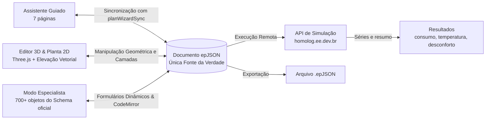

# Energy Input

> **Arquivos epJSON para EnergyPlus** — Modelagem termoenergética rápida, paramétrica e orientada por schema diretamente no navegador.

[](https://www.typescriptlang.org/)
[](https://reactjs.org/)
[](https://vitejs.dev/)
[](https://tailwindcss.com/)
[](https://threejs.org/)
[](https://energyplus.net/)
[](https://vitest.dev/)
[](https://www.docker.com/)

---

## 1. O que é o Energy Input?

O **Energy Input** é uma aplicação web moderna (_Single-Page Application_ — SPA), 100% _client-side_, projetada para simplificar drasticamente a criação, edição paramétrica, validação e inspeção de arquivos de entrada no formato **epJSON** para o motor de simulação **EnergyPlus**.

Historicamente, o uso do EnergyPlus dependia do formato textual legado (IDF/IDD) e de ferramentas complexas com curva de aprendizado íngreme. O **Energy Input** permite partir de decisões conceituais de alto nível (orientação, clima, geometria da planta, materiais, cargas e climatização) e obter em segundos um modelo epJSON válido, robusto e pronto para simulação.

Todo o aplicativo opera sobre uma **única fonte da verdade reativa**: o documento epJSON em memória. Usuários e agentes podem alternar livremente entre três modos integrados de edição, e um quarto modo, **Resultados**, lê as execuções concluídas sem alterar o documento.

---

## 2. Modos de Operação



### 🪄 Modo 1: Assistente Guiado (Wizard)

Conduz o usuário em 7 páginas, com geração procedural de objetos epJSON. Três delas reúnem duas etapas de resposta cada, para um fluxo com menos cliques:

1. **Projeto e clima**
   - **Projeto:** Nome, orientação solar (Norte 0–360°), tipo de terreno e controle de simulação.
   - **Localização e Clima:** Cidades brasileiras pré-configuradas (zonas bioclimáticas NBR 15220-3, ASHRAE Design Days, temperaturas de solo amortecidas) ou upload de arquivos `.epw` / `.ddy`.
2. **Período da Simulação:** Ano completo (com suporte a _year-wrapping_), intervalos de datas ou apenas dias de projeto.
3. **Geometria:**
   - **Bloco Retangular (_Shoebox_):** Dimensões $X \times Y$, número de pavimentos, pé-direito, lajes intermediárias e condições de contorno de piso/teto.
   - **Planta 2D por Ambientes:** Editor vetorial interativo com paleta de formas (retângulo, L, triângulo, hexágono), desenho livre com coordenadas em metros, validação topológica, cálculo automático de área/perímetro/volume e divisão automática de paredes compartilhadas em "T".
4. **Materiais e janelas**
   - **Materiais e Envoltória:** Presets habitacionais (**Casa** com alvenaria tradicional e **Apartamento** com blocos de 14 cm, lajes de 12 cm, forro de gesso e lajes de borda adiabáticas), com cálculo em tempo real de Transmitância ($U$) e Capacidade Térmica ($CT$).
   - **Janelas e Esquadrias:** Taxa de abertura de fachada (WWR) por orientação e catálogo de vidros (simples, duplos, Low-E, esquadrias de PVC com `WindowProperty:FrameAndDivider`).
5. **Uso e climatização**
   - **Uso do Edifício:** Presets de ocupação, iluminação, equipamentos e horários (`Schedule:Compact`).
   - **Climatização (HVAC):** Modelagem de cargas com `ZoneHVAC:IdealLoadsAirSystem` e termostatos de duplo setpoint.
6. **Resultados:** Seleção de variáveis e tabelas de saída (`Output:Table:SummaryReports` `AllSummary`, conforto térmico, etc.).
7. **Revisão e Download:** Resumo visual, pré-visualização do JSON bruto, exportação `.epJSON` ou disparo direto para simulação na nuvem.

### 🧊 Modo 2: Editor 3D e Geometria Paramétrica

Permite inspecionar e manipular graficamente a edificação:

- Visualização interativa com **Three.js** e **React Three Fiber** (órbita, pan, zoom e isolamento por pavimento).
- **Espessura real de materiais:** As paredes são extrudadas para dentro conforme a espessura total de sua respectiva `Construction`.
- **Paredes e lajes compartilhadas (`sharedSurfaces.ts`):** Identificação geométrica rigorosa (tolerância de 0,1 mm e normais opostas). O 3D exibe um único elemento físico centrado, enquanto o epJSON gera dois objetos `Surface` pareados com construções invertidas.
- **Aberturas em paredes compartilhadas:** Inserção de portas, janelas e portas de vidro entre zonas térmicas, atualizando simultaneamente as duas zonas com coordenadas locais e espelhamento correto.
- **Elevação 2D interativa (`WallElevation`):** Posicionamento e dimensionamento de aberturas com _snap_ de 5 cm ou digitação numérica exata.
- **Editor de camadas de materiais:** Reordenação de camadas, ajuste de espessuras e controle de escopo (_"aplicar a todos os elementos"_ vs. _"copiar e aplicar apenas a este"_).

### 🛠️ Modo 3: Modo Especialista (Schema-Driven)

Editor completo e de baixo nível governado pelo **JSON Schema oficial** do EnergyPlus (`Energy+.schema.epJSON` v26.1):

- Sidebar categorizada com todos os **700+ tipos de objetos** e contagem de instâncias.
- Formulários tipados gerados dinamicamente (números com unidades do SI, enums, seletores `anyOf` com `"Autosize"`/`"Autocalculate"`).
- Integridade referencial inteligente: campos de `object-list` possuem autocomplete buscando instâncias válidas existentes no arquivo, alerta de referências órfãs e criação _inline_.
- Tabelas extensíveis para listas de vértices de polígonos e tabelas de horários.
- Renomeação segura com propagação automática em cascata por todo o documento.
- Editor de código JSON integrado (**CodeMirror 6**) sincronizado bidirecionalmente.
- Validação contínua com **Ajv 8** e mensagens de diagnóstico traduzidas para pt-BR.

### ☁️ Módulo de Simulação em Nuvem

- Conexão direta com a API de homologação (`https://homolog.ee.dev.br/v1`).
- Upload multipart do modelo epJSON, seleção de versões compatíveis do motor EnergyPlus e arquivos climáticos EPW.
- Acompanhamento reativo de status (`queued`, `running`, `succeeded`, `failed`, `cancelled`, `timeout`), exibição de logs/erros e download de artefatos gerados.
- Login com e-mail e senha da conta no serviço: simulações, estudos e versões ficam na organização (tenant) de quem entrou. O token fica só na memória da aba e é renovado por cookie HttpOnly; recarregar a página não pede login. Criar e baixar epJSON não exige conta.

### 📊 Modo 4: Resultados

Lê uma execução concluída — a desta sessão ou qualquer outra, pelo identificador `sim_…` — e **não altera o documento**. As séries vêm da API em JSON; nada de `.csv`/`.sql` é interpretado no navegador.

- **Consumo anual:** consumo medido, por uso final e pico de demanda, em kWh, com barras mensais.
- **Temperatura operativa:** curva anual com a amplitude de cada dia, carpete dia × hora e a externa para comparação.
- **Horas de desconforto:** frio e quente **em separado**, horas sem dado à vista, carpete por estado de conforto e dois critérios — a faixa do termostato do modelo e a faixa adaptativa ASHRAE 55 / EN 16798.
- Execução em dias de projeto e série expirada pela retenção do serviço aparecem como estados explicados, não como gráfico vazio.
- Indicadores **informativos**; não são verificação de conformidade com norma.

---

## 3. Arquitetura e Princípios de Engenharia

Para humanos e agentes de IA que contribuem neste repositório, os seguintes princípios arquiteturais são **invioláveis**:

1. **`src/core/` é 100% puro e isolado (Framework-Free):**
   - Lógica de epJSON, validação, parsers climáticos, cálculo de $U$/$CT$ e algoritmos de geometria residem em `src/core/`.
   - **NÃO** importe React, hooks, Zustand, Three.js ou objetos do DOM (`window`/`document`) dentro de `src/core/`. Todas as funções devem ser determinísticas e testáveis diretamente no Vitest via terminal.
2. **`schema/` é a fonte da verdade do EnergyPlus:**
   - O arquivo `schema/<versão>/Energy+.schema.epJSON` é extraído do pacote oficial de release do EnergyPlus. Não edite este arquivo manualmente.
   - O script `npm run schema` compila a versão servida em `public/schema/<versão>/schema.json`.
3. **Proteção contra perda de dados (`planWizardSync`):**
   - O assistente nunca sobrescreve silenciosamente objetos customizados pelo usuário no Modo Especialista ou 3D. Quando há divergência de intenção, o diálogo de resolução de conflitos deve ser disparado. Objetos novos criados pelo usuário nunca são apagados.
4. **Nenhum segredo em bundle nem em storage persistente:**
   - Nenhuma credencial em `localStorage`/`sessionStorage`: o token de acesso vive na memória da aba e o refresh token em cookie HttpOnly. Os proxies não têm credencial própria; recusam rotas fora da lista, métodos fora de GET/POST e pedidos de outra origem ([ADR-0004](docs/adr/0004-login-de-usuario-e-token-na-memoria.md)).
5. **Conformidade de Marca:**
   - O nome oficial do produto é **Energy Input** ("Arquivos epJSON para EnergyPlus"). Nunca utilize "EnergyPlus API" como nome comercial (cláusula 4 da licença do EnergyPlus).

---

## 4. Estrutura de Diretórios

```
energy-input/
├── docs/                   # Documentação técnica e histórico do projeto
│   ├── PRD.md              # Requisitos de produto (fonte da verdade do escopo)
│   ├── DEVELOPMENT.md      # Notas técnicas de arquitetura, geometria e simulação
│   ├── backlog.md          # Tarefas ativas, pendências e dependências
│   ├── tasks/              # Histórico de tarefas executadas (baseado em _template.md)
│   └── adr/                # Decisões de arquitetura registradas
├── schema/                 # Schemas oficiais do EnergyPlus (ex: 26.1/Energy+.schema.epJSON)
├── public/                 # Assets estáticos e schema compilado servido pelo Vite
├── src/
│   ├── core/               # Domínio puro (epjson, geometry, schema, sync, validation, weather)
│   ├── generators/         # Geradores funcionais puros: (respostas) -> fragmento epJSON
│   │   ├── geometry/       # boxGeometry.ts (shoebox) e floorPlan.ts (planta 2D)
│   │   └── compose.ts      # Função que orquestra e mescla os fragmentos
│   ├── templates/          # Catálogos desacoplados (climas, materiais, cargas, esquadrias)
│   ├── store/              # Stores globais Zustand (documentStore, wizardStore, etc.)
│   ├── features/           # Módulos de interface
│   │   ├── wizard/         # assistente (7 páginas), ilustrações SVG, conflitos
│   │   ├── geometry/       # Editor 3D (Three.js/R3F), elevação e árvore de elementos
│   │   ├── expert/         # Navegador de tipos, formulários dinâmicos e CodeMirror
│   │   ├── simulation/     # Diálogo de envio à API, polling de status e artefatos
│   │   └── preview/        # Visualizador 3D compacto
│   ├── ui/                 # Primitivas de interface (botões, modais, inputs, comboboxes)
│   ├── App.tsx             # Shell da aplicação, cabeçalho e listeners de atalhos
│   └── main.tsx            # Ponto de entrada React
├── scripts/                # Scripts utilitários (build-schema, eplus-check, fetch-schema)
├── docker/                 # Configuração do Nginx de produção e proxy de simulação
├── Dockerfile              # Build multi-stage (Node 20 Alpine -> Nginx Alpine ~56 MB)
├── docker-compose.yml      # Execução local do container estático
├── AGENTS.md               # Instruções de trabalho para agentes de IA e desenvolvedores
└── CONTEXT.md              # Briefing original e contexto de fundação do projeto
```

---

## 5. Guia Rápido de Instalação e Uso

### Pré-requisitos

- **Node.js** $\ge \text{20.x}$
- **npm** $\ge \text{10.x}$
- (Opcional) **Docker** e **Docker Compose** para execução do container de produção.
- (Opcional) **EnergyPlus v26.1.0** instalado localmente caso deseje executar os smoke tests com o motor real.

### 🚀 Rodando em Desenvolvimento

```bash
# 1. Instale as dependências
npm install

# 2. Inicie o servidor Vite (compila os schemas automaticamente)
npm run dev
```

Abra [http://localhost:5173](http://localhost:5173) no navegador.

### 🧪 Portões de Qualidade e Testes

Antes de enviar alterações ou abrir Pull Requests, certifique-se de que os portões locais estão verdes:

```bash
# Validação estrita de tipos TypeScript (tsc -b --noEmit)
npm run typecheck

# Execução da suíte completa de testes (Vitest)
npm test

# Validação do build de produção estático (dist/)
npm run build

# (Opcional) Teste de conformidade com EnergyPlus local real
EPLUS_DIR=/Applications/EnergyPlus-26-1-0 npm run eplus-check
```

### 🐳 Executando com Docker

O projeto possui build multi-stage gerando uma imagem Nginx ultraleve (~56 MB):

```bash
# Construir e rodar via Compose
docker compose up --build
```

Acesse a aplicação em [http://localhost:8080](http://localhost:8080).

---

## 6. Mapa da Documentação

| Arquivo                                              | Finalidade                                                                                                   |
| ---------------------------------------------------- | ------------------------------------------------------------------------------------------------------------ |
| [`docs/PRD.md`](docs/PRD.md)                         | **Fonte da verdade de produto:** escopo funcional, personas, critérios de aceite e requisitos.               |
| [`AGENTS.md`](AGENTS.md)                             | **Protocolo de trabalho:** convenções de branch, commit, testes e regras invioláveis para agentes e humanos. |
| [`docs/DEVELOPMENT.md`](docs/DEVELOPMENT.md)         | **Notas técnicas de engenharia:** algoritmos de geometria, paredes compartilhadas, tolerâncias e API.        |
| [`docs/backlog.md`](docs/backlog.md)                 | **Gestão de tarefas:** quadro de tarefas ativas, dependências e backlog.                                     |
| [`docs/tasks/_template.md`](docs/tasks/_template.md) | **Template de tarefa:** padrão para documentação imutável de entregas em `docs/tasks/`.                      |
| [`CONTEXT.md`](CONTEXT.md)                           | **Briefing original:** documento de concepção inicial do projeto.                                            |

---

## 7. Licença

Este projeto é desenvolvido para geração e manipulação de arquivos do **EnergyPlus** (motor desenvolvido pelo Departamento de Energia dos EUA — DOE / NREL). O Energy Input segue as diretrizes da licença oficial do EnergyPlus e os termos de código aberto aplicáveis.
