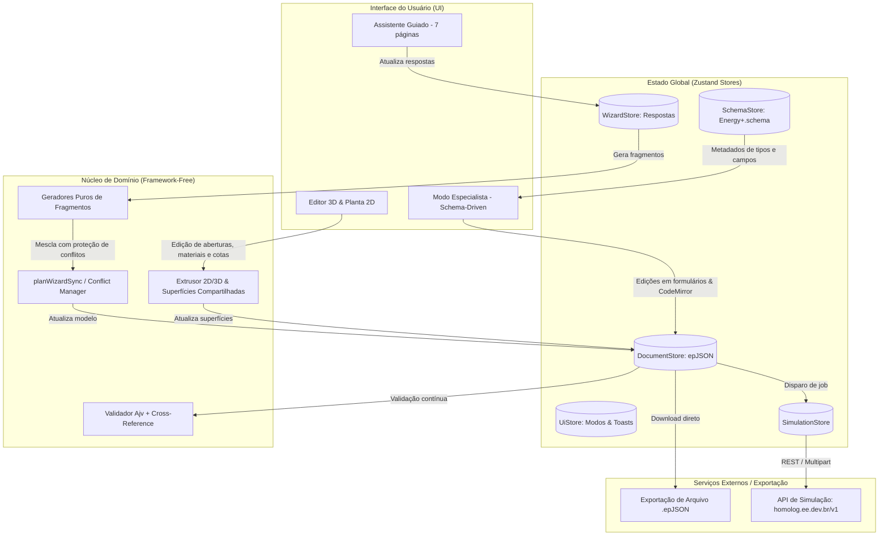

# Product Requirements Document (PRD) — Energy Input

**Documento de Requisitos do Produto**  
**Versão:** 1.0.0  
**Data:** 22 de setembro de 2026  
**Status:** Aprovado / Em Produção (v0.1.0)  
**Autor:** Equipe de Engenharia e Produto  
**Repositório:** `energy-input`

---

## 1. Visão Geral e Propósito

### 1.1 Declaração do Problema

A simulação termoenergética de edificações através do motor **EnergyPlus** é o padrão de referência da indústria e da academia mundial. No entanto, o processo tradicional de criação e edição de arquivos de entrada é historicamente hostil:

- O formato legado **IDF/IDD** é textual, rígido e complexo.
- O novo formato padrão estruturado **epJSON** (JSON Schema oficial do EnergyPlus com mais de 700 tipos de objetos e dezenas de milhares de campos) possui especificidades complexas (como palavras-chave `extensible`, `object-list`, tipos híbridos com `Autosize`/`Autocalculate` e ausência de chaves estrangeiras nativas no JSON).
- Ferramentas legadas são pesadas, exigem instalação desktop complexa, demandam conhecimentos avançados de termodinâmica predial desde os primeiros passos e não oferecem facilidade para testes rápidos de modelos e cenários.

### 1.2 Visão do Produto

O **Energy Input** é uma aplicação web moderna (Single-Page Application — SPA), com interface em português (pt-BR), projetada para permitir que projetistas, arquitetos, engenheiros e consultores criem, editem, visualizem e validem arquivos de entrada **epJSON** para o EnergyPlus com agilidade e máxima confiabilidade técnica.

O aplicativo une três níveis complementares de trabalho sobre o **mesmo documento epJSON reativo**:

1. **Assistente Guiado (Modo Básico):** Conduz o usuário em 7 páginas intuitivas, abstraindo a complexidade de baixo nível e gerando modelos completos, válidos e prontos para simulação.
2. **Editor 3D Paramétrico (Modo Geometria):** Permite inspecionar a edificação em Three.js, editar graficamente e numericamente paredes, lajes, esquadrias e camadas de materiais construtivos com espessura real e cálculo térmico.
3. **Editor Especialista (Modo Especialista):** Disponibiliza uma interface técnica orientada pelo JSON Schema oficial do EnergyPlus, com navegação pelos 700+ tipos de objetos, validação em tempo real e editor JSON sincronizado.
4. **Módulo de Simulação em Nuvem:** Envio direto do modelo para execução na API de simulação (`homolog.ee.dev.br/v1`), com acompanhamento de progresso e download de artefatos.

### 1.3 Cláusulas Legais e de Marca

Conforme as diretrizes de licenciamento do motor EnergyPlus:

- O produto chama-se **Energy Input** ("Arquivos epJSON para EnergyPlus").
- É estritamente vedado o uso de "EnergyPlus API" ou "EnergyPlus" como marca comercial proprietária.

---

## 2. Personas e Casos de Uso

| Persona                                             | Perfil                                                               | Necessidade Principal                                                                                                  | Modo Preferencial                          |
| --------------------------------------------------- | -------------------------------------------------------------------- | ---------------------------------------------------------------------------------------------------------------------- | ------------------------------------------ |
| **Engenheiro / Consultor de Eficiência Energética** | Especialista em simulação e normas (NBR 15575, ASHRAE 90.1, LEED).   | Criar uma base rápida para estudos de envelope térmico e ajustar parâmetros detalhados ou inspecionar epJSON bruto.    | Assistente → Editor 3D → Modo Especialista |
| **Arquiteto / Projetista de Edificações**           | Foco em projeto conceitual, orientação solar, aberturas e materiais. | Modelar a planta baixa da casa/edifício, definir janelas/portas e testar materiais com cálculo de transmitância ($U$). | Assistente (Planta 2D) + Editor 3D         |
| **Pesquisador / Estudante Universitário**           | Usuário acadêmico de conforto térmico e eficiência.                  | Gerar arquivos epJSON válidos sem erros de sintaxe ou referências quebradas para rodar em experimentos.                | Assistente + Modo Especialista             |
| **Desenvolvedor / Integrador de APIs**              | Engenheiro de software integrando ferramentas de automação predial.  | Validar compatibilidade de modelos sintéticos, testar schemas e rodar simulações na API de homologação.                | Modo Especialista + Painel de Simulação    |

---

## 3. Arquitetura do Sistema e Pilha Tecnológica

### 3.1 Pilha Tecnológica (Stack)

- **Linguagem & Tipagem:** TypeScript 5.6 (modo estrito com `strict: true`).
- **Framework Frontend:** React 18.3.
- **Ferramenta de Build & Dev Server:** Vite 6.
- **Estilização:** Tailwind CSS 3.4 (paleta harmoniosa com modos de alto contraste e componentes semânticos).
- **Gerenciamento de Estado:** Zustand 5.0 (armazenamento imutável e granular por seletores).
- **Renderização 3D:** Three.js 0.169 + `@react-three/fiber` 8.18 + `@react-three/drei` 9.122.
- **Editor de Código / JSON:** CodeMirror 6 (`@codemirror/lang-json`, `@codemirror/lint`, `@codemirror/view`).
- **Validação de Schemas:** Ajv 8.20 com compilação sob demanda (lazy sub-schema compilation).
- **Ícones:** Lucide React.
- **Testes Automatizados:** Vitest 3.2.
- **Infraestrutura / Deploy:** Docker multi-stage (Node 20 Alpine para build e Nginx 1.27 Alpine para runtime estático de ~56 MB).

### 3.2 Modelo de Dados e Fonte da Verdade

- **Estrutura Unificada:** Toda a aplicação lê e altera uma única árvore de dados epJSON mantida no `documentStore`.
- **Integridade Referencial em Memória:** Os nomes de instâncias são tratados com propagação automática de renomeação em cascata (`renameObjectWithPropagation`), clonagem e exclusão segura.
- **Histórico e Recuperação:** Suporte a Desfazer e Refazer (`undo`/`redo` via atalhos universais `Ctrl+Z` / `Ctrl+Shift+Z`) com pilha de transições imutáveis.
- **Persistência Local (Autosave):** O documento ativo e o rascunho de respostas são salvos automaticamente no `localStorage` do navegador com debouncing de 800 ms.
- **Controle de Origem & Reset:** O sistema registra a origem do modelo (`scratch` ou `upload`). O botão "Resetar edição" permite recomeçar o assistente do zero ou restaurar o arquivo original importado, com diálogo de confirmação.



---

## 4. Requisitos Funcionais Detalhados

### 4.1 MODO 1: Assistente Guiado (Wizard)

As dez etapas de resposta abaixo são apresentadas em **sete páginas**: projeto com clima, materiais com janelas, e uso com climatização dividem página (T026). As respostas continuam separadas por etapa — é o que o gerador consome —; só a navegação foi agrupada.

O modo padrão guia o usuário para construir uma simulação térmica completa a partir de decisões conceituais de alto nível.

#### Página 1 — Projeto

- **Entradas:** Nome do edifício, orientação do eixo norte (0° a 360°), tipo de terreno (`Country`, `Suburbs`, `City`, `Ocean`, `Urban`).
- **Objetos Gerados no epJSON:**
  - `Building` (com nome, rotação de norte e terreno);
  - `SimulationControl` (com flags habilitadas para dimensionamento e simulação climática);
  - `Timestep` (padrão de 6 passos por hora);
  - `HeatBalanceAlgorithm` (padrão Conduction Transfer Function — CTF).

#### Página 1 — Localização e Clima

- **Entradas:** Seleção de cidades brasileiras pré-cadastradas ou upload de arquivo `.epw` / `.ddy`.
- **Funcionalidades:**
  - Identificação e exibição da Zona Bioclimática brasileira (NBR 15220-3);
  - Cálculo de temperaturas de solo mensais amortecidas (`Site:GroundTemperature:BuildingSurface`);
  - Incorporação dos dias de projeto de inverno e verão (`SizingPeriod:DesignDay`).
- **Objetos Gerados no epJSON:**
  - `Site:Location`;
  - `SizingPeriod:DesignDay` (mínimo 2 dias de projeto típicos);
  - `Site:GroundTemperature:BuildingSurface`.

#### Página 2 — Período da Simulação

- **Entradas:** Ano completo (padrão), período restrito por datas (dia/mês inicial e final) ou somente dias de projeto.
- **Tratamento especial:** Suporte a virada de ano (year-wrapping).
- **Objetos Gerados no epJSON:**
  - `RunPeriod`.

#### Página 3 — Geometria

O usuário pode optar por duas abordagens geométricas complementares:

##### Opção A: Bloco Retangular (Shoebox)

- Entradas: Largura ($X$ em metros), Comprimento ($Y$ em metros), Número de pavimentos (1 a $N$), Pé-direito (m), Rotação.
- Condições de contorno: Primeiro piso (assente no solo, pilotis ventilado ou laje adjacente adiabática) e Cobertura (telhado exposto ou laje adjacente).
- Geração automática de zonas empilhadas: uma zona térmica por pavimento, com separação automática de lajes entre pavimentos (`Surface` pareadas).

##### Opção B: Planta 2D por Ambientes (Floor Plan Editor)

- Editor gráfico vetorial cartesiano interativo em metros com suporte a teclado e mouse:
  - Paleta de formas rápidas: Retângulo, Quadrado, Triângulo, Formato em "L" e Hexágono.
  - Desenho livre por adição de vértices no plano cartesiano ou digitação de coordenadas numéricas $(X, Y)$.
  - Seleção e movimentação de vértices, arestas e ambientes inteiros com snap configurável e atalhos de teclado (Delete, setas direcionais, Tab, Shift para 10 passos).
  - Desfazer / Refazer completo no rascunho da planta (`Ctrl/Cmd+Z`, `Ctrl/Cmd+Shift+Z`).
  - Validação topológica rígida: impede autointerseções, arestas menores que 1 cm, polígonos com menos de 0,01 m² e sobreposição indevida entre zonas.
  - Divisão automática de paredes compartilhadas em encontros tipo "T" e pareamento mútuo entre zonas adjacentes.
  - Cálculo automático e em tempo real de área ($m^2$), perímetro ($m$) e volume ($m^3$) por zona térmica.

- **Objetos Gerados no epJSON:**
  - `GlobalGeometryRules` (coordenadas relativas, sentido anti-horário, início no canto superior esquerdo);
  - `Zone` para cada ambiente e pavimento;
  - `BuildingSurface:Detailed` (paredes externas, paredes internas divididas e pareadas, pisos, lajes entre pavimentos e coberturas).

#### Página 4 — Materiais e Envoltória

- **Presets Especializados:**
  - **Casa (Padrão):** Alvenaria cerâmica tradicional rebocada, laje de concreto, piso sobre o solo e telhado cerâmico/fibrocimento.
  - **Apartamento:** Parede estrutural/alvenaria de bloco de concreto de 14 cm rebocado, laje maciça de concreto de 12 cm, contrapiso com acabamento cerâmico ou vinílico, forro de gesso e contatos externos de primeiro piso e último teto definidos como superfícies adjacentes adiabáticas (representando apartamentos vizinhos fora do domínio de cálculo).
- **Indicadores Construtivos:** Exibição imediata da Transmitância Térmica ($U$ em $W/m^2K$) e Capacidade Térmica ($CT$ em $kJ/m^2K$) conforme NBR 15220-2 / NBR 15575.
- **Objetos Gerados no epJSON:**
  - `Material` (propriedades termofísicas completas: espessura, condutividade, densidade, calor específico, absortâncias térmica e solar);
  - `Construction` (composição ordenada das camadas do exterior para o interior).

#### Página 4 — Janelas e Esquadrias

- **Entradas:** Percentual de abertura (Window-to-Wall Ratio — WWR) por fachada ou global; seleção de tecnologia de envidraçamento (Vidro Simples 3mm/6mm, Vidro Duplo Insulado, Vidro Duplo Low-E, Vidro Laminado com PVC).
- **Objetos Gerados no epJSON:**
  - `Window` ou `FenestrationSurface:Detailed`;
  - `WindowMaterial:SimpleGlazingSystem` ou `WindowMaterial:Glazing`;
  - `WindowProperty:FrameAndDivider` (quando aplicável).

#### Página 5 — Uso do Edifício e Cargas Internas

- **Entradas:** Finalidade do edifício (Residencial, Escritório Comercial, Sala de Aula, etc.), densidade de ocupação e perfis de uso.
- **Objetos Gerados no epJSON:**
  - `People` (número ou densidade de pessoas por zona, fração radiante);
  - `Lights` (potência de iluminação em $W/m^2$ e fração convectiva/radiante);
  - `ElectricEquipment` (cargas de plugue/eletrodomésticos em $W/m^2$);
  - `ScheduleTypeLimits` e `Schedule:Compact` (horários de ocupação, iluminação e equipamentos em dias de semana, sábados e domingos).

#### Página 5 — Climatização (HVAC)

- **Entradas:** Definição de setpoints de aquecimento e resfriamento (ex.: aquecimento até 20 °C, resfriamento acima de 24 °C).
- **Abordagem Técnica:** Sistema de ar ideal (`Ideal Loads`), ideal para cálculo puro das cargas térmicas horárias sem vincular a um fabricante ou ciclo de refrigeração específico.
- **Objetos Gerados no epJSON:**
  - `ZoneHVAC:IdealLoadsAirSystem`;
  - `ZoneHVAC:EquipmentList` e `ZoneHVAC:EquipmentConnections`;
  - `ThermostatSetpoint:DualSetpoint`;
  - `ZoneControl:Thermostat`.

#### Página 6 — Resultados e Saídas

- **Entradas:** Seleção de pacotes de relatórios (Resumo Geral de Energia, Conforto Térmico Fanger/PMV, Balanço Térmico de Zonas, Perfil de Temperaturas Horárias).
- **Objetos Gerados no epJSON:**
  - `Output:Table:SummaryReports` (padrão `AllSummary`);
  - `Output:Variable` e `Output:Meter` para variáveis requisitadas;
  - `OutputControl:Table:Style` (formatação tabular HTML/CSV).

#### Página 7 — Revisão, Download e Envio

- **Funcionalidades:**
  - Cartões explicativos com todas as opções selecionadas;
  - Pré-visualização do código JSON formatado em modal;
  - Botão de download do arquivo `.epJSON` com nome baseado no projeto;
  - Ação para envio direto à API de Simulação;
  - Botão para abrir no Editor 3D ou no Modo Especialista.

---

### 4.2 MODO 2: Editor 3D e Geometria Paramétrica

Permite a manipulação direta e visual dos elementos construtivos sobre o mesmo documento.

1. **Cena 3D Interativa:**
   - Órbita, translação (pan), aproximação (zoom) e enquadramento automático da câmera.
   - Malhas das paredes renderizadas com **extrusão para dentro baseada na espessura real** da respectiva `Construction`.
   - Recortes geométricos precisos para portas, janelas e portas de vidro.
   - Filtro de visualização por pavimento e isolamento de zonas térmicas.

2. **Superfícies e Paredes Compartilhadas (`sharedSurfaces.ts`):**
   - Detecção automática de paredes e lajes em contato entre duas zonas distintas (tolerância de 0,1 mm, normais opostas e vértices coincidentes).
   - O Three.js renderiza **um único elemento físico** centralizado na interface.
   - O epJSON mantém a representação física rigorosa: **duas superfícies térmicas** do tipo `Surface`, apontando uma para a outra via `outside_boundary_condition_object`, com as camadas de materiais automaticamente invertidas.
   - A edição da construção em um lado sincroniza automaticamente o lado parceiro.

3. **Inserção e Edição de Aberturas (Esquadrias):**
   - Adição de Janela, Porta e Porta de Vidro diretamente sobre a parede selecionada.
   - Painel de elevação 2D da parede (`WallElevation`) com ajuste fino por arrasto (snap de 5 cm) ou digitação milimétrica de distância do canto e peitoril/altura.
   - Validação em tempo real de limites e sobreposição de aberturas.
   - Inserção em paredes compartilhadas: cria automaticamente o par de aberturas (`FenestrationSurface:Detailed`) na zona vizinha com coordenadas locais e orientação oposta.

4. **Gerenciamento de Materiais e Camadas:**
   - Inspeção de cada camada da construção selecionada (espessura, condutividade, massa específica, calor específico).
   - Reordenação de camadas (arrastar e soltar).
   - Ajuste de espessura de camada com opção de escopo: _"Modificar para todos os elementos que usam esta construção"_ ou _"Criar variante e aplicar somente a este elemento"_.
   - Exibição em tempo real de $U$ e $CT$.

---

### 4.3 MODO 3: Modo Especialista (Schema-Driven Editor)

Interface avançada para inspeção completa, diagnóstico e edição de qualquer um dos 700+ objetos suportados pela especificação do EnergyPlus.

1. **Navegador de Tipos por Categoria:**
   - Classificação conforme o padrão oficial do EnergyPlus (Simulation Parameters, Location and Climate, Schedules, Surface Construction Elements, Thermal Zones and Surfaces, Internal Gains, HVAC, Output, etc.).
   - Filtro textual com contagem instantânea de instâncias criadas no documento.

2. **Renderizador Dinâmico de Formulários:**
   - Mapeamento estrito baseado no JSON Schema:
     - Campos de número/inteiro com suporte a vírgula brasileira, limites mínimos e máximos e unidade de medida visível;
     - Caixas de seleção (combobox pesquisável para opções extensas);
     - Switches para campos com `anyOf` entre valor numérico e enums `"Autosize"` / `"Autocalculate"`;
     - Campos de referência cruzada (`object-list` e `reference-class-name`): autocomplete inteligente buscando os nomes de objetos válidos existentes no documento, com indicador de referência quebrada (dangling reference) e botão para criar o objeto alvo diretamente;
     - Tabelas de grupos extensíveis (`extensible` arrays): inserção, remoção e reordenação de linhas (ex.: lista de vértices de superfícies).
   - Suporte a clonar instância, excluir instância e renomear com propagação automática de todas as referências cruzadas no documento.

3. **Editor JSON Bruto Integrado (CodeMirror 6):**
   - Visualização e edição do arquivo completo ou do objeto selecionado.
   - Sincronização bidirecional em tempo real com a árvore de objetos e com o validador.
   - Destaque de sintaxe, formatação e verificação de erros JSON.

4. **Painel de Validação e Diagnóstico:**
   - Validação contínua contra o JSON Schema oficial do EnergyPlus via Ajv 8 compilado sob demanda.
   - Tradução de erros para pt-BR com indicação precisa do objeto, campo e valor esperado.
   - Detecção de nomes duplicados dentro da mesma classe de objeto.
   - Identificação de referências cruzadas quebradas.

---

### 4.4 Sincronização Inteligente e Proteção contra Conflitos

O produto permite alternar livremente entre o Assistente, o Editor 3D e o Modo Especialista sem perda de dados:

- **Gerador Baseado em Respostas:** Alterações no assistente re-executam as funções geradoras (`compose.ts`).
- **Planejador de Sincronização (`planWizardSync`):**
  - Armazena hashes de propriedade dos objetos criados originalmente pelo assistente.
  - Objetos que o usuário customizou no Modo 3D ou Especialista têm suas alterações preservadas silenciosamente caso o assistente não tenha tentado modificar o mesmo objeto.
  - Caso haja colisão direta (o usuário alterou manualmente um objeto e depois alterou uma etapa do assistente que mexe no mesmo objeto), um diálogo amigável é exibido: **"Manter alterações manuais"** ou **"Sobrescrever com o Assistente"**.
  - Objetos criados manualmente pelo usuário nunca são apagados pelo assistente, e o assistente nunca apaga um objeto que algo ainda referencia.
  - **Exceção anunciada:** ao trocar o vidro no assistente, as janelas desenhadas pelo usuário que seguiam o vidro anterior passam para o novo, com aviso na tela. Janela com outro vidro, escolhido no Modo Especialista ou no Editor 3D, fica como está ([ADR-0002](adr/0002-janelas-acompanham-o-vidro-do-assistente.md)).

---

### 4.5 Módulo de Simulação em Nuvem (Homologação API)

1. **Acesso e Painel de Controle:**
   - Acionado via ícone no cabeçalho ou na etapa final de revisão.
   - Diálogo em duas vistas. **Configurar:** conecta sozinho ao abrir e já traz escolhidos o motor compatível e o clima do catálogo mais próximo do `Site:Location` do modelo (até 100 km); o usuário confere e clica em **Simular**. **Acompanhar:** linha do tempo Envio → Fila → EnergyPlus → Resultados; ao concluir, **Analisar resultados** leva ao modo Resultados (§4.6); em falha, o diagnóstico do EnergyPlus e **Ajustar o modelo**. Diagnóstico, eventos e arquivos da execução ficam recolhidos na mesma vista.

2. **Fluxo de Integração RESTful (`https://homolog.ee.dev.br/v1`):**
   - **Autenticação:** Token Bearer vindo da variável de ambiente `SIMULATION_API_TOKEN`, injetado pelo proxy do servidor — o do Vite em desenvolvimento e o do contêiner em produção. A interface não pede credencial.
   - **Catálogo de Motores:** Consulta a `/engines` para selecionar versões compatíveis do EnergyPlus (ex.: 26.1.0).
   - **Upload de Modelo:** Envio multipart (`file`) para `/models`, obtendo o identificador do modelo e versão.
   - **Despacho de Simulação:** Requisição `POST /simulations` com o `versao.id`, `engine_id`, `weather_id` (ou upload de EPW) e cabeçalho de proteção `Idempotency-Key`.
   - **Acompanhamento (Polling):** Sondagem a cada 5 segundos para transição de estados (`queued` $\rightarrow$ `running` $\rightarrow$ `succeeded` / `failed` / `cancelled` / `timeout`).
   - **Recuperação de Falhas e Retomada:** Armazenamento em `sessionStorage` do ID da simulação e da chave idempotente para permitir reabertura de aba sem perda de monitoramento.

3. **Tratamento de Resultados e Artefatos:**
   - Exibição de resumo (`summary`), avisos e erros (`errors`) e logs de execução (`stdout`/`stderr`).
   - **Séries temporais em JSON**, sem baixar nem interpretar `.csv`/`.sql` no navegador: `/results/timeseries` (uma variável por chamada, paginada por `proximo_cursor`) e `/results/variables` (catálogo RDD/MDD). A série vive com o `eplusout.sql` e responde **410** quando a retenção o apaga; o `summary` é **permanente** e continua disponível. São a fonte do modo Resultados (§4.6).
   - Disponibilização de arquivos gerados (ex.: `.csv`, `.html`, `.eso`, `.err`) através de links pré-assinados temporários (transformação de redirecionamento 302 para evitar exposição de cabeçalhos de autorização). **Hoje bloqueado no serviço:** o 302 aponta para uma URL interna em HTTP, que o proxy recusa corretamente (T021 do backlog).

### 4.6 MODO 4: Resultados (Dashboards de Análise Energética)

Quarto item do cabeçalho, carregado sob demanda. **Lê** resultados de uma execução concluída e **não escreve** no documento epJSON — os três modos anteriores continuam sendo os únicos que o editam.

1. **Origem dos dados:** a execução acompanhada nesta sessão, ou qualquer execução anterior adotada pelo identificador (`sim_…`), inclusive de outra sessão.
2. **Painéis:**
   - **Consumo anual:** consumo medido, consumo por uso final (do resumo permanente) e pico de demanda elétrica; barras mensais por medidor e barras por uso final, em kWh. Distingue medidor **ausente** de medidor **registrado marcando zero**.
   - **Temperatura operativa:** curva anual com a amplitude de cada dia (mínima, média e máxima), carpete dia × hora e a temperatura externa para comparação. Seletor de zona quando a execução registrou mais de uma.
   - **Horas de desconforto:** horas **frias e quentes em separado** — pedem decisões de projeto opostas —, confortáveis e sem dado; barras mensais classificadas e carpete por estado. Dois critérios: a **faixa fixa** lida do termostato do modelo aberto, e a **faixa adaptativa** da ASHRAE 55 / EN 16798, que informa em quantos dias caiu para a faixa fixa. Os indicadores do resumo permanente aparecem rotulados pelo que medem: os de setpoint medem controle do sistema, não conforto.
3. **Estados sem gráfico, tratados como estados e não como erro:** nenhuma execução, execução em andamento, execução sem sucesso, execução em **dias de projeto** (não há ano para agregar) e **série expirada** (410).
4. **Postura:** indicadores informativos, na mesma linha de `src/generators/nbr15575.ts` — **não** são verificação de conformidade com norma.
5. **Planejado (Fase 3 do épico E1):** agrupar e comparar execuções por **estudo paramétrico** (`/v1/studies`).

---

## 5. Requisitos Não-Funcionais

### 5.1 Desempenho e Eficiência

- **Arquitetura 100% Client-Side:** O processamento da geometria, sincronização de schemas e validações ocorrem inteiramente na thread do navegador.
- **Compilação de Schemas Sob Demanda:** O schema do EnergyPlus possui dezenas de milhares de linhas e levaria mais de 1 segundo para compilar integralmente no Ajv. A aplicação compila apenas o sub-schema do tipo de objeto em exibição/validação, garantindo respostas em menos de 16 ms (60 FPS) nas transições de tela.
- **Asset Otimizado:** Imagem Docker final com Nginx Alpine de aproximadamente 56 MB, com suporte a compressão Gzip e cache imutável para bundles com hash.

### 5.2 Usabilidade, Acessibilidade e Idioma

- **Linguagem Natural em Português (pt-BR):** Rótulos, unidades de medida, explicações conceituais e mensagens de erro do schema inteiramente localizadas.
- **Teclado e Acessibilidade:** Suporte abrangente a navegação por teclado, incluindo atalhos rápidos (`Ctrl+Z`, `Ctrl+Shift+Z`, `Tab`, `Shift+Tab`, `Esc` para cancelar operações de arrasto no 2D/3D).

### 5.3 Segurança e Privacidade

- **Privacidade por Padrão:** Nenhum arquivo epJSON criado ou aberto pelo usuário é transmitido para servidores de terceiros a menos que o usuário clique explicitamente em "Simular modelo".
- **Isolamento de Credenciais:** A chave da API de simulação existe só no ambiente do servidor (`SIMULATION_API_TOKEN`, no proxy de desenvolvimento e no contêiner). O navegador nunca a recebe nem a digita, e ela nunca vai para o bundle nem para logs ([ADR-0003](adr/0003-chave-da-api-no-ambiente-do-servidor.md)).
- **Proxy Seguro:** Proxy reverso local no Vite e no Nginx elimina necessidades de CORS e oculta URLs sensíveis.

### 5.4 Confiabilidade e Tolerância a Falhas

- **Validação com o Motor Real:** Todos os geradores e combinações de presets são verificados continuamente via script `scripts/eplus-check.ts` contra uma instalação real do EnergyPlus v26.1.0, garantindo **zero erros Severe ou Fatal** em execuções de teste.

---

## 6. Estrutura e Organização do Código

O repositório segue estrita separação entre regras de domínio puras e componentes de interface:

```
energy-input/
├── schema/                 # Schemas JSON oficiais por versão do EnergyPlus (ex: 26.1)
├── public/                 # Assets públicos e schema processado em runtime
├── src/
│   ├── core/               # Domínio puro (sem dependência do React, testável via CLI)
│   │   ├── epjson/         # Tipos epJSON e operações imutáveis (clone, rename, diff)
│   │   ├── geometry/       # Modelos de leitura 2D/3D, cálculo U/CT, superfícies compartilhadas
│   │   ├── schema/         # Índice do schema, mapeador FieldSpec, schema slim
│   │   ├── sync/           # Planejador de sincronização Wizard ⇄ Documento (hashes)
│   │   ├── validation/     # Wrapper Ajv, mensagens em pt-BR e integridade referencial
│   │   └── weather/        # Parsers de EPW e DDY, estimativas climáticas
│   ├── generators/         # Funções puras: (respostas) -> fragmento epJSON
│   │   ├── geometry/       # boxGeometry.ts (shoebox) e floorPlan.ts (planta 2D)
│   │   └── compose.ts      # Função central que orquestra a fusão dos geradores
│   ├── templates/          # Catálogos de dados desacoplados (climas, materiais, cargas, esquadrias)
│   ├── store/              # Estados globais em Zustand (document, wizard, schema, ui)
│   ├── features/           # Módulos de interface visual
│   │   ├── wizard/         # assistente (7 páginas), ilustrações SVG, resolução de conflitos
│   │   ├── geometry/       # Editor 3D (Three.js/R3F), elevação de paredes, árvore de elementos
│   │   ├── expert/         # Navegador de tipos, formulários dinâmicos, editor CodeMirror
│   │   └── simulation/     # Modal de envio, polling de status e download de artefatos
│   ├── ui/                 # Primitives visuais (botões, diálogos, inputs, comboboxes)
│   ├── App.tsx             # Casca principal, cabeçalho, navegação e listeners globais
│   └── main.tsx            # Ponto de entrada React
├── scripts/                # Automações de desenvolvimento (fetch-schema, eplus-check, etc.)
└── docker/                 # Configurações de container e Nginx de produção
```

---

## 7. Critérios de Aceite e Métricas de Sucesso

### 7.1 Critérios de Aceite Funcionais

1. **Geração de Arquivo Válido:** Todo arquivo gerado pelo Assistente (tanto no modo Bloco quanto no modo Planta 2D) deve ser validado pelo Ajv sem erros de conformidade com o schema do EnergyPlus.
2. **Execução no EnergyPlus:** Arquivos de exemplo gerados pelo aplicativo devem rodar até o final no EnergyPlus 26.1.0 sem erros com status `Fatal` ou `Severe`.
3. **Paredes Compartilhadas Sem Vazamento:** Em plantas com 2 ou mais zonas contíguas, o pareamento das superfícies térmicas internas deve conter nomes e construções inversas estritamente correspondentes.
4. **Respeito a Edições Manuais:** Nenhuma edição feita no Modo 3D ou Especialista pode ser deletada silenciosamente por uma troca de resposta no Assistente.
5. **Autonomia de Desfazer:** O comando `Ctrl+Z` / `Ctrl+Shift+Z` deve restaurar fielmente o estado anterior do documento epJSON.

### 7.2 Métricas de Desempenho e Qualidade

- **Tempo de Inicialização:** Carregamento inicial da página e do schema padrão em menos de 1,5 segundos em conexões padrão banda larga.
- **Taxa de Cobertura de Testes:** Suíte de testes automatizados (`vitest`) cobrindo 100% das operações de geradores, mapeadores de schema e pareamento de superfícies geométricas.
- **Responsividade Gráfica:** Taxa de quadros no Editor 3D mantida em $\ge 60\text{ fps}$ para modelos de até 50 zonas térmicas.

---

## 8. Não-Escopo (Fora de Escopo Nesta Versão)

- **Motor Local Embutido:** O navegador não compila nem executa o binário do EnergyPlus (o cálculo térmico é feito exclusivamente via exportação de arquivo ou via API remota de simulação).
- **Importação de IDF Legado:** Suporte exclusivo ao formato epJSON moderno (sem conversor IDF $\leftrightarrow$ epJSON client-side embutido).
- **Coberturas com Telhados Complexos em Múltiplas Águas:** O gerador automatizado da planta 2D foca em coberturas planas e lajes; geometrias de telhados recortados com mansardas permanecem para edição em modo especialista.
- **Sistemas HVAC Complexos Detalhados:** No Assistente, a modelagem HVAC foca em `IdealLoadsAirSystem`; sistemas reais detalhados (como VAV multi-zona, chillers a água e VRF) devem ser configurados no Modo Especialista.

---

## 9. Próximos Passos e Roadmap Futuro

1. ~~**Dashboards de Análise Energética:** Visualização gráfica direta na aplicação das curvas
   de consumo anual, temperaturas operativas e horas de desconforto geradas pelos artefatos da
   simulação.~~ **Entregue** no modo **Resultados** (T006–T011, [`backlog.md`](backlog.md)
   épico E1): os três painéis desenham a partir das séries que a API devolve em JSON, sem
   baixar nem interpretar `.csv`/`.sql` no navegador. Falta a **Fase 3** do épico — agrupar e
   comparar execuções por **estudo paramétrico** (T012–T015).
2. **Presets HVAC Expandidos:** Criação de templates pré-configurados de expansão direta (Split / Pacote) e ventilação mecânica no assistente.
3. **Compatibilidade com Schemas Futuros do EnergyPlus:** Automação de pipeline para ingestão contínua de novas versões lançadas pelo NREL/DOE.
4. **Importação e Conversão de Plantas Arquitetônicas (DXF / SVG):** Permitir upload de linhas de paredes a partir de desenhos CAD ou SketchUp para traçado automático da planta 2D.
